# CSE151A_Proj

## Introduction
We chose to make our project about the Titanic because it is one of the most infamous maritime disasters in history resulting in only 706 survivors out of 2,240 total passengers. Our group aims to investigate the factors that could have potentially influenced passenger survival during this famous shipwreck using a data-driven approach. We thought that it would be cool to create a probabilistic model by analyzing the impact of certain attributes on the likelihood of survival and identifying each passenger's class. Specifically, we analyzed the attributes age, sex, the presence of siblings/spouses on board, the presence of parents/children on board, and fare. We plan to create a logistic regression model to predict likelihood of survival based on their other attributes of the passengers. To avoid simplicity and to make our model more complex, we also plan to create new features and to create a Kmeans Cluster Model, Decision Tree Model, and a Neural Network Model, to predict a passenger's class ('Pclass' attribute') based on the other attributes of the passengers. Through this research, and with a good predictive model, we will be able to enhance our knowledge of survival determinants in large-scale disasters while also honoring the memory of those affected by the tragedy. 

## Methods
  * Data Exploration (Included in the Logistic Regression Model Notebook):
    * For the data exploration section, we read in our dataset and displayed it to see our initial number of features (8) and our initial number of observations (887).
    * Before we decided to explore our data fully, we decided to preprocess data, with methods that are discussed in the preprocessing section. After this step, we explored our data by printing out several eye-catching graphics which were discussed during lecture. We also chose to print out graphics like histograms, pairplots, and correlation coefficients. We then calculated some statistical data such as percentile, mean, and standard deviation on our revised dataset. 
    * Data Exploration Link: https://github.com/CBelleLopez/CSE151A_Proj/blob/main/Logistic_Regression_Model_Project_WriteUp.ipynb
  * Preprocessing:
    * For preprocessing our dataset, we built upon the basic preprocessing which included dropping the 'Name' feature and convert the 'Gender' feature to a binary choice of either 0 or 1. From here, we decided to individualize the different preprocessing we used for each model.
      * For the Logistic Regression Model (which also contains our data exploration), we transformed our modified dataset and normalized the values of our features, and we used ‘Survived’ as our target variable when splitting our dataset into train and test datasets.
      * For the Kmeans Cluster Model, we created a new feature labeled ‘Family_Size’, we dropped the features 'Siblings/Spouses Aboard' and 'Parents/Children Aboard', and we used ‘Pclass’ as our target variable when splitting our dataset into train and test datasets.
      * For the Decision Tree Model, we created a new feature labeled ‘Family_Size’, and we used ‘Pclass’ as our target variable when splitting our dataset into train and test datasets.
      * For the Neural Network Model, we created two new features labeled ‘Family Size’ and ‘Travel Alone’, we transformed our modified dataset and normalized the values of our features, we one hot encoded our ‘Pclass’ feature into three distance features which were ‘1’, ‘2’, and ‘3’ (each number represents the passengers class where 3 is the lower class, 2 is the middle class, and 1 is the upper class), and we used our three distinct Pclass features (‘1’, ‘2’, and ‘3’) as our target variables.
    * Note: Each model does different major preprocessing, but the links for other models are displayed in the subsection of each model.
  * Logistic Regression Model:
    * In the hopes of learning which model could be best for predicting our chosen class within our Titanic dataset, we started of by doing logistic regression, one of the first techniques we learned in this class. In conducting a logistic regression, we used the LogisticRegression method within the sklearn library. To introduce the relevant steps that we took to ensure a successful approach to logistic regresion, we
      * Initated a MinMaxScaler() object and scaled our data
      * Created train and test data for our model by using a 80/20 split respectively
      * Applied predictions using these data and finally checked the model's accuracy.
    * For results of this section, we printed out a classification report, the feature coefficients using a scatterplot and several more scatterplots comparing different features with our target variable ‘Survived’ using their line of best fits.
    * Logistic Regression Model Link: https://github.com/CBelleLopez/CSE151A_Proj/blob/main/Logistic_Regression_Model_Project_WriteUp.ipynb
  * Kmeans Cluster Model: 
    * As we wanted to expand on what KMeans could do, we decided to create a new feature 'family_size' which was the combination of two already declared features 'Siblings/Spouses Aboard' and 'Parents/Children Aboard.' This feature has also been used in several other models and will be reflected as such. In addition, we decided to drop those said features 'Siblings/Spouses Aboard' and 'Parents/Children Aboard'.
    * KMeans has only one parameter of how many clusters we want, which we set to 3. In analyzing the results of our model, we printed our Mean Squared Error and plotted out several 3D models of how accurately KMeans was able to distinguish each passenger's class based on a varying feature set every time.
    * Kmeans Cluster Model Link: https://github.com/CBelleLopez/CSE151A_Proj/blob/main/KMeans_Cluster_Model_Project_WriteUp.ipynb
  * Decision Tree Model: 
    * A sklearn decision tree first requires us to split the train and test data in a 80/20 split respectively and then fit the model using the resulting X_train and y_train data. From here the model takes over to determine what splits are required to accruately determine which features are generally accustomed to one class.
    * Following this, our results include a printed graphic of how our tree looks including the features it split on, and the mean accuracy of the tree.
    * Decision Tree Model Link: https://github.com/CBelleLopez/CSE151A_Proj/blob/main/Decision_Tree_Model_Project_WriteUp.ipynb
  * Neural Network Model: 
    * Before running this model, we also chose to puruse a few additional steps.
      * Added another feature for this model called 'Travel Alone'
      * One-hot encoded the output data and do a train and test split on a 80/20 respectively
    * Built our sequential neural network by having three dense layers.
      1. Our first & input layer has 128 units and uses relu as the activation function
      2. Another layer with 64 units which also has relu as the activation function
      3. Final and output layer has 3 units and has softmax as the activation function.
    * The model then gets compiled using Adam() as the optimizer and checks loss per categorial_crossentropy and uses accuracy as its metric of accuracy. We also used an early_stopping callback mechanic as introduced in HW3 to either end early or continue the training process based on the score. We finally fit our model per our train data using a batch size of 10 running for 100 epochs.
    * The results of this model include a classification report per training and test data, and a confusion matrix.
    * Neural Network Model Link: https://github.com/CBelleLopez/CSE151A_Proj/blob/main/Neural_Network_Model_Project_WriteUp.ipynb

## Results
  * Data Exploration (Included in the Logistic Regression Model Notebook):
    * This sections featured all the different graphics we thought of generating before we decided to tackle our dataset.
    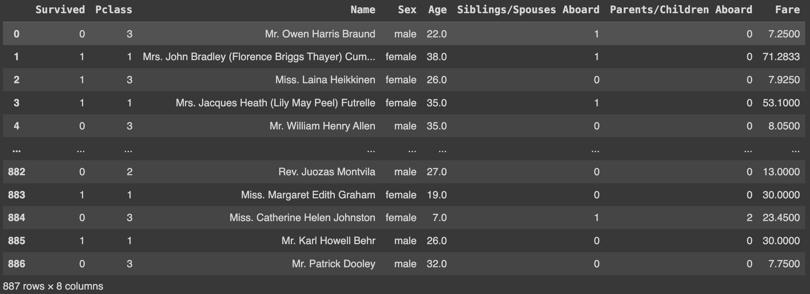
    

      <em>Figure 1: View of our dataset and features pre-processing.</em>
    

    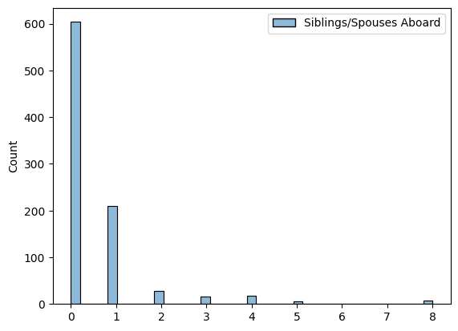
    

      <em>Figure 2: Histogram of different values contained in 'Siblings/Spouses Aboard' feature.</em>
    

    
    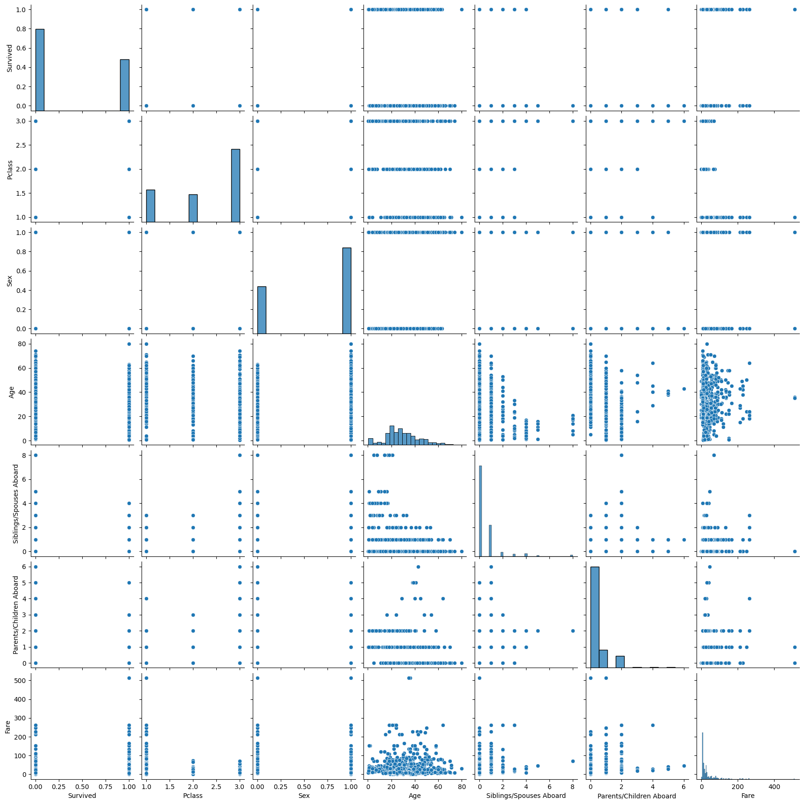
    

      <em>Figure 3: Pairplot of all features contained in processed dataset..</em>
    

    
    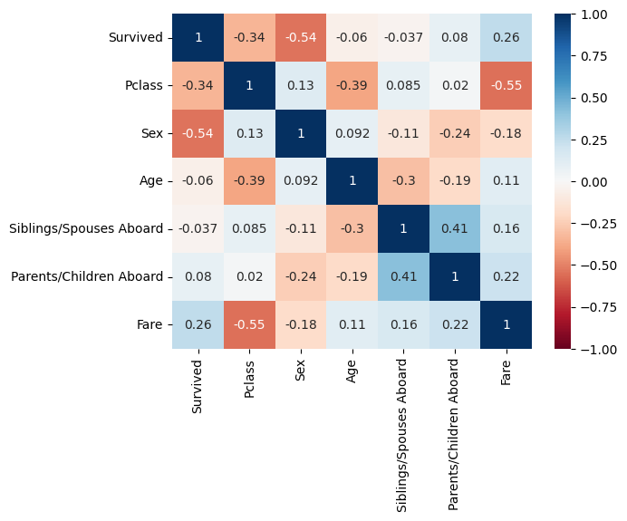
    

      <em>Figure 4: Heatmap with all features in dataframe pictures.</em>
    

  * Preprocessing:
    * There were not many results for the major preprocessing since there was not much output during major preprocessing, but any resulting output from major preprocessing is displayed within each Model’s Notebooks.
    * Note: Each model does different major preprocessing, and the links for each different model and all its graphics are included in each respective notebook.
  * Logistic Regression Model:
    * For our logistic regression model, around "0.45" was our training error and around "0.44" was our testing error. When we printed out a classification report to see our precision and recall, our model had around 79% accuracy on the training data and around 0.82% accuracy on the test data. Even printing our scatterplot displayed a check-mark eqsue shape. Taking a look at the coefficients, Pclass (Passenger class) seems to have a negative coefficient of around -1.97, sex has a coefficient of around -2.40, age has a coefficient of -1.86, siblings/spouses aboard has a negative coefficient of -1.58, parents/children aboard has a negative coefficient of -0.42, and fare has a coefficient of 0.55. For the classification report, coefficient scatterplot, and logistic regression plots, the resulting diagrams are displayed within our Logistic Regression Model Notebook.

    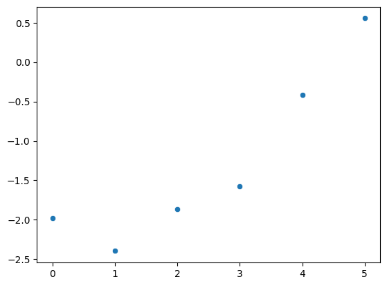
    

      <em>Figure 5: Scatterplot of all coefficients/features in linear regression.</em>
    

    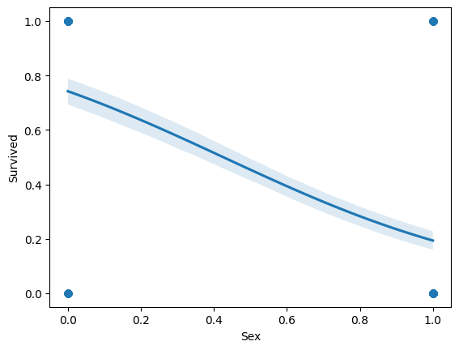
    

      <em>Figure 6: Linear regression predicting the probability of 'survival' given 'sex'.</em>
    

  * Kmeans Cluster Model:
    * This model was where we first started using our new 'family_size' feature and how it looks in practice.

    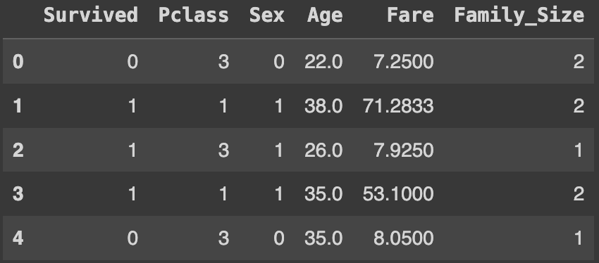
    

      <em>Figure 7: How 'family_size' feature looks.</em>
    

    * For our KMeans model, we found that our training MSE was around "0.95" and our testing MSE was "1.16". When we also checked for our KMeans' accuracy, we saw that the testing accuracy was around "0.54" and our training accuracy was "0.6" The 3D models are also included which depict how KMeans identify classes.

    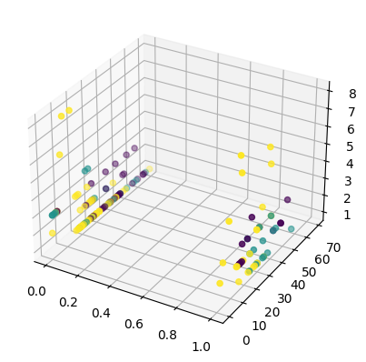
    

      <em>Figure 8: 3D depcition of KMeans identifying features 'Sex', 'Age' and 'Family_Size.</em>
    

  * Decision Tree Model: 
    * For our decision tree results, we produced our model score based on the train datasets which we got around "0.83" and for our testing datasets we got "0.58."

    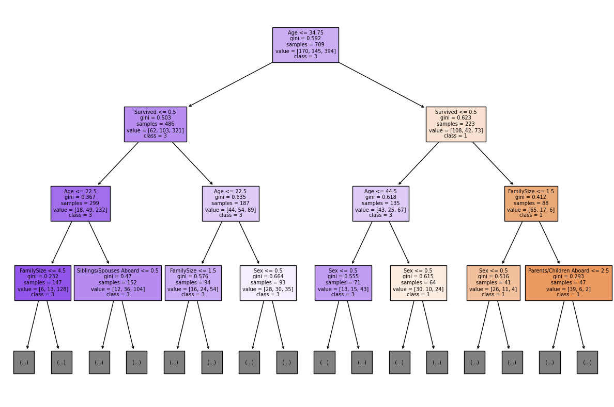
    

      <em>Figure 9: Decision tree graphic.</em>
    

  * Neural Network Model:
    * Results for our neural network were outputted in our two different classification reports for training data and the testing data. We also outputted a confusion matrix on these results as well.

    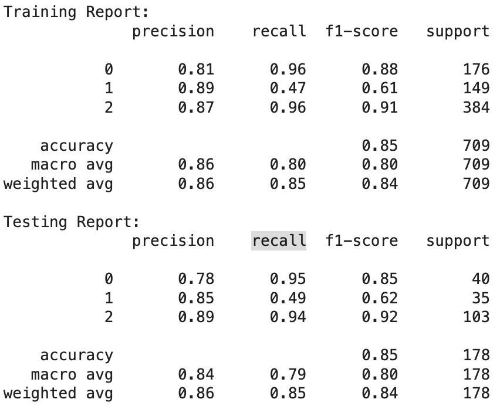
    

      <em>Figure 10: Classification reports on training and testing data.</em>
    

    
    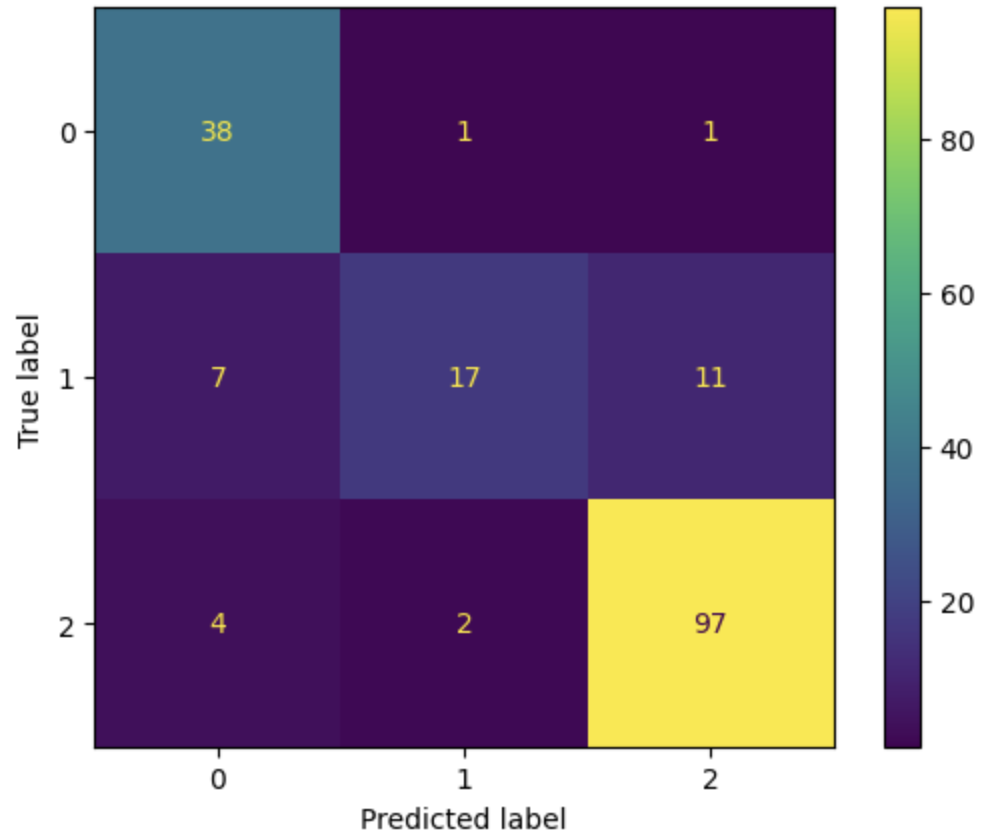
    

      <em>Figure 11: Confusion matrix on test data.</em>
    

## Discussion
### Data Exploration
We began data exploration by printing out the raw data within the dataset. We noticed that there were a total of eight features with 887 total observations, each observation being a unique passenger of the Titanic. The features within this data set are: ‘Survived’ which is a binary value that indicates if a passenger survived the disaster, ‘Pclass’ which indicates the class of the passenger, ‘Name’ being the passengers’ name, ‘Sex’ indicating male or female, ‘Age’ being the passengers’ age, ‘Siblings/Spouses Aboard’ displays the number of siblings or spouses that were brought along, ‘Parents/Children Aboard’ functioning nearly the same as the previous feature however detecting parents or children instead, and ‘Fare’ which indicates how much the passenger paid for the trip.

A few features had inconsistent values from each other, i.e. name and sex had string values while the others had numerical values. Additionally, there were numerical features that only contained one digit while others had decimals. Fare, for example, contains a decimal point followed by four digits while Pclass had only three unique values: 1, 2, and 3. 
There are a few features we have created histograms for in order to see the distribution of data, most notably ‘Survived’, ‘Parents/Children Aboard’, and ‘Siblings/Spouses Aboard.’ Taking a look at the ‘Survived’ histogram, we took note that more people have died than survived. The next two features contain right skewed histograms that indicate many people did not bring any family members along with them or brought very few. 

Two pair plots were made where one was made without a specific hue while the other was with ‘hue = ‘Survived’. We created these to see if there was any correlation between our data without having to look at a heatmap (which we will do later). They both create a diagonal as expected and the plots are reasonable. The pairplot with a set hue was created before our change in plans of topic from ‘Survived’ to ‘Pclass’, so it would have been better to set the hue as so.

Up next we take a look at a heatmap of our data. Taking note of the more darker parts of the map, we began to make sense of it. ‘Siblings/Spouses Aboard’ and ‘Parents/Children Aboard’ have some correlation and that is reasonable considering that they both track family members. A somewhat high correlation with ‘Pclass’ and ‘Fare’ is reasonable because the higher class a passenger is, the more they have to pay. A more surprising correlation that we noticed was ‘Survived’ and ‘Sex’. It seemed to have a -0.54 value which was the second to highest value in our heatmap. This indicated that there was definitely a relationship between a passenger's sex and whether or not they survived. We thought that there wouldn’t be a high correlation, however we were clearly proven wrong.

### Preprocessing
In order to conduct our data analysis, we decided to drop the ‘Name’ column because we felt that it wouldn’t provide much information. It could serve as a unique identifier for each observation, however it wasn’t necessary. Furthermore, we decided to encode the sex column with 1s and 0s, male and female respectively, in order to better visualize our data as well as provide uniformity so that all of our values are numeric. Preprocessing went differently for each of our models so we will state those changes within their respective sections below.

### Logistic Regression
Something to note is that this model was created before we were informed that our data set was too easy to work with so much of this analysis was conducted on predicting survival. For this model, we decided to import libraries from sklearn. More specifically, imported LogisticRegression, MinMaxScalar, and train_test_split. Before conducting any splitting, we decided to scale and transform our data with MinMaxScalar because our data set includes many ranges of values. These changes are essential because we don’t want any specific features to overpower other features. Additionally, we’ve decided to remove observations in which ‘Fare’ is equal to 0 because that also has a chance of skewing our data and providing us inaccurate values. 

Once this preprocessing was done, we conducted the train test split in which we dropped the ‘Survived’ column to set it as our target variable. We’ve split it in terms of training 80 and test 20 as learned in class. After that, we ran the Logistic Regression library we’ve imported with a max iteration of 1000, fit our train variables, then conducted predictions on both test and train data. After producing scores of both test and train, we noted how they performed somewhat close to each other with a test score of 0.84 and a train score of ~0.79. We believed that this meant our model was predicting well since our accuracy was high but not too perfect. We also took a look at our loss functions, which also seemed to be fairly close to each other as well. All of this made us believe that our model generalizes well to new data because the close values are usually indicative of not underfitting or overfitting. We’ve concluded that our model suggests that the higher the fare a passenger paid they are more likely to survive. The same thing goes for female passengers. 

What could have been improved on were the plots created to visualize our data. The scatter plot seems to be a good indication of the highest predictors, yet our other plots don’t seem to provide a good visualization since the lines that are created don’t necessarily have any of the plotted points near it. They are all significantly out of scope. Our results may be completely wrong as there may be many different variables that slipped our mind, but the numerical data that resulted from this model has led us to believe that our model performed decently.

### KMeans Cluster
This model was created after we were told not to center our models on survival so instead this model aims to create clusters of the different passenger classes. For preprocessing, we dropped ‘Pclass’, as that is our target variable, and set it as our y. Additionally, we’ve created a new feature ‘Family_Size’ so that we can have one single variable to track family members on board rather than having two features that essentially track the same thing. 

We then initialize our KMeans to contain 3 clusters, which aligns with our goal of creating three different clusters each respective of passenger class. During our data exploration, we’ve noticed how there were passengers who paid significantly more compared to the higher class even though they were of a lower class. We deduced that this meant ‘Fare’ was the total amount that a passenger has paid including any tickets they have paid for their family members. Thus, we construct a for loop to run through the data and change each respective fare value by dividing a passenger’s fare by their family size to account for this. After splitting our data with train_test_split and conducting the predictions on both test and train, we saw that the mean squared error for both were somewhat close to each other. Accuracy was also within the same ballpark of each other. We believe that this means this model performs decently, albeit not too accurate. We plotted our data within a 3D space using both test and train data and we were able to come up with figures, however interpreting them was a struggle for our group. Our ground truth figures contained the 3 different colors indicating the different classes, however the predicted data usually had a majority of one color rather than having all 3 colors. We aren’t too sure if this is an error as there are signs of clustering. 

Even after talking with a TA, we were told that there “definitely is something there.” As for if this model is predicting correctly or if there were any mistakes in our preprocessing or use of KMeans Clustering, our group is not too confident. However, being able to come up with some sort of data to go off of was an accomplishment. There may be other methods of improving our model, however our group isn’t very knowledgeable when it comes to KMeans Clustering but we’ve certainly done what we could.

### Decision Tree
This was another model created after being told not to center our models off of survival so this one also aims to predict passenger class. The preprocessing in this section is nearly identical to the KMeans section by constructing a ‘FamilySize’ column but we decided to keep the Siblings and Parents columns so our decision tree has more features to work off of. As usual, our target variable is set as ‘Pclass’ since that is what we’re predicting. After creating our model, fitting it, and creating the tree model, we’re met with a very clean model that we cut off after a depth of 3 since there’s tons of data. A lot of splitting can be seen and most of the nodes that are visible are decision nodes with no terminal nodes in sight. If we were to lift the restriction of depth, our model would eventually end, however it creates a model that isn’t very easy on the eyes. Something interesting to note is that we have encoded male and female as 1 and 0 yet the decision tree is showing us “sex <= 0.5”. This may be due to transformations done on our data to create the tree, but we are not knowledgeable enough to know. After conducting research, we found that the darker the color, the more observations belong to that node so if we take a look at the darker colored purple node, we can see that most passengers that had a family size of <= 4.5 were of class 3 with their ages being <= 22.5. Family size being <= 4.5 covers a lot of our observations so it is reasonable that most of the data falls within that node. 

The accuracy generated from our model leaves a lot to be desired. Our train seems to perform relatively well while our test has somewhat lower accuracy. This indicates that our model is overfitting. Overfitting leads to poor performance on new, unseen test data, meaning that our model has not generalized well to new patterns. With decision trees being covered so late during the semester, we are not totally knowledgeable on how to improve the performance of this model, but we were able to get a grasp of how our data looks in tree form and gained experience in creating them.

### Neural Network
This was the last model created aimed to predict passenger class. Preprocessing consisted of adding a new ‘Family Size’ feature as well as a ‘Travel Alone’ feature indicating that that passenger is traveling by themselves. We then scale our data using MinMaxScalar since our data is not normally distributed. As usual, we drop ‘Pclass’ from our feature matrix and set it as our target variable. In order to properly use a Neural Network to predict passenger class, we need to one hot encode ‘Pclass’ as it will give us an error down the line when creating the NN when trying to create 3 units in our output. Thus we used the get_dummies command so that each class is set as 0s and 1s indicating if they are of the 1st, 2nd, or 3rd class. 

We decided to use a Dense Sequential NN because it was what we were most familiar with. Our NN contains two hidden layers, both using relu as the activation function, and for the output we decided to use softmax with 3 units since we are trying to predict three classes. We went along with relu as our activation functions within the hidden layers because it is the most commonly used activation function compared to the other functions. For our output, we could not use sigmoid as it is a binary classifier, so we decided to go with another function we haven’t used yet. Hyperbolic tangent was another contender, however we decided to go with softmax because it seemed to be less complicated. Because our problem isn’t binary classification, we decided to go with categorical cross entropy for our loss and set our optimizer as Adam when compiling our model. We decided to go with Adam since it is the most used optimizer even though we have not utilized it in class. Perhaps if we used SGD we might have gotten different results. Early stopping was also implemented into our model so that when we fit our model, epochs that hardly change in terms of loss will be skipped, which makes it run faster. 

We opted to predict on both test and train data so we can draw comparisons between the two and see if underfitting or overfitting is occurring. Printing our classification reports for both data, we note that both have nearly the same accuracy. What’s interesting to note is the low recall score when classifying passenger class 2. It is down in the 40s compared to the other recall scores which are up in the 90s. This means that classifying passenger class 2 has a high false negative rate. Other than that, everything else seems to be performing decently well. This also is reflected when we print out the confusion matrices. A diagonal is what we’re looking for, however it seems to be consistent that trying to classify class 2 is all over the place. All in all, this model performs decently well, however it probably would have been great to create another model with different layers and activation functions as a comparison to gauge how well (or not) this model did.

## Conclusion
We began this project trying to predict survival rate using logistic regression, but we were told last minute this was too simple so we had to think more abstractly. We were able to come up with k means clustering, a decision tree, and a neural network model to predict the class of a passenger. One thing we could do differently in the future is dive deeper into these models and optimize them further, varying the amount of nodes in the neural network and experimenting with various activation functions. We could also perform cross validation to further validate our results. We could also think of new ways to use the new features we created and draw further conclusions about the interrelationships among features. Overall, this project successfully demonstrated the application of various modeling techniques on the Titanic dataset, and there is always room for improvement in the predictive capabilities of the models. 

## Statement of Collaboration
Andrew Lu: Group Member - I attended a hacking session to get extra clarification and guidance on what to add to our project since we were informed after Milestone 3 that our original proposal was too simple, I did the coding for the Kmeans Clustering Model Notebook and helped with the coding for the Decision Tree Model Notebook. 

Bryant Quijada: Group Member - I attended a hacking session to get extra clarification and guidance on what to add to our project since we were informed after Milestone 3 that our original proposal was too simple, I did the coding for the Neural Network Model Notebook (with the assistance of Clarabelle and Fayaz through their suggestions and debugging help), I made copies of each model’s notebook and uploaded onto github, I completed the Introduction section, and I completed the Data Exploration subsection, Preprocessing subsection, and Logistic Regression Model subsection for the Methods and Results sections.

Clarabelle Lopez: Group Member - I attended a hacking session to get extra clarification and guidance on what to add to our project since we were informed after Milestone 3 that our original proposal was too simple, I collaborated with Bryant during the creation of the code for the Neural Network Model Notebook by giving suggestions and helping debug. I also completed the discussion section for the report in the ReadMe.   

Fayaz Shaik: Group Member - I attended a hacking session to get extra clarification and guidance on what to add to our project since we were informed after Milestone 3 that our original proposal was too simple, I collaborated with Bryant during the creation of the code for the Neural Network Model Notebook by giving suggestions and helping debug, I added figures to the results section, and I completed the Kmeans Cluster Model subsection, Decision Tree Model subsection, and Neural Network Model subsection for the Methods and Results sections. 

Jordan Phillips: Group Member - I attended a hacking session to get extra clarification and guidance on what to add to our project since we were informed after Milestone 3 that our original proposal was too simple, I helped with some of the coding for the Kmeans Clustering Model coding and Decision Tree Model coding, and I completed the conclusion section for the report in the ReadMe.  

Owen Lam: Group Member - I attended a hacking session to get extra clarification and guidance on what to add to our project since we were informed after Milestone 3 that our original proposal was too simple, I did the coding for the Decision Tree Model Notebook, helped out with the Kmeans clustering coding, I attended office hours to get feedback on our revised proposal and our Kmeans Clustering Model Notebook, helped manage version control and resolved merge conflicts. 

---

Milestone 2 Update:

We already started on the preprocessing step due to our not being able to properly graph the names feature since those were entered as strings and there is no possible way for us to encode that to numerical values. The sex features were encoded to [0,1] where 0 represented females and 1 represented males. Future preprocessing steps that we could take is dropping fares that cost zero dollars as that would skewer the correlation between fare cost and survival chances. Normalization would have to be implemented for fare and age since the numerical values can increase or decrease drastically which can affect the sensitivity of our algorithm. Nornmalizing them to the same as sex and survival would allow our features to have the same range making it easier to find correlation. 

Milestone 3 Update:

This milestone involved us dealing with data pre-processing. We first tried this out by training a logistic regression model to our data, which involves the general steps of scaling the data and splitting the dataset. We printed out a classification report to see our precision and recall and our model did fairly well with a 79% accuracy. Even printing our scatterplot displayed a check-mark eqsue shape which indicated that the second feature was the least important and growing more important with each subsequent feature. We printed out several scatterplots with their line of best fits, whose discussion and results are included in our notebook. To improve our results, we could maybe have done further normalization and include more datasets to reflect a better prediction on the relations between these features. Our results can be seen within our notebook.

---

